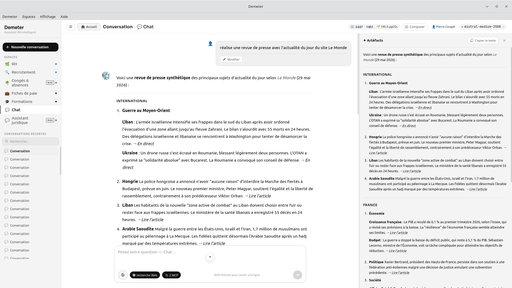

# MCP Browser — Serveur MCP de navigation web avancée

[](https://www.python.org/)
[](https://modelcontextprotocol.io/)
[](https://playwright.dev/)
[](https://www.gnu.org/licenses/agpl-3.0.html)

Serveur MCP HTTP Streamable (spec 2025-03-26) permettant à n'importe quel client MCP de **piloter un vrai navigateur Chromium headless** pour rechercher, naviguer, extraire et interagir avec le web — y compris les pages JavaScript complexes, shadow DOM, et applications React/Vue.

---

## Aperçu



---


## Fonctionnalités

### 11 outils MCP

| Outil | Description |
|---|---|
| `browser_rechercher` | Recherche web via DuckDuckGo / Bing / Google / SearXNG |
| `browser_naviguer` | Navigation et extraction (markdown, HTML, texte) |
| `browser_screenshot` | Capture d'écran pleine page ou élément ciblé (bloc image MCP natif) |
| `browser_cliquer` | Clic sur un élément CSS avec attente JS |
| `browser_formulaire` | Remplissage et soumission de formulaires |
| `browser_research` | Mode multi-sources avec extraits consolidés |
| `browser_chercher_images` | Recherche d'images multi-sources (Wikimedia, OpenVerse, Bing) |
| `browser_session_demarrer` | Session persistante (cookies, logins conservés) |
| `browser_session_arreter` | Fermeture propre de la session |
| `browser_healthcheck` | Vérification opérationnelle du navigateur |

---

### Anti-détection multi-couches

#### Human mode (activé par défaut)
- Délais aléatoires entre les actions
- Déplacement naturel de la souris avant les clics
- Défilement par étapes avec accélération/décélération réaliste
- Frappe caractère par caractère dans les formulaires
- Rotation automatique du user-agent (Chrome 136/137, Firefox 137, Edge 136)
- Headers `Sec-CH-UA` cohérents avec l'UA sélectionné

#### Stealth mode (intégré en permanence)
- Masquage du flag `navigator.webdriver` et suppression des markers ChromeDriver (`$cdc_`, `$wdc_`)
- Plugins navigateur réalistes (3 plugins Chrome natifs simulés)
- Langue et timezone cohérentes (`fr-FR` / `Europe/Paris`)
- Hardware concurrency et device memory réalistes (8 cœurs, 8 Go)
- Objet `window.chrome` complet (runtime, csi, loadTimes)
- WebGL vendor/renderer réalistes (`Intel UHD Graphics 620`)
- `outerWidth`/`outerHeight` et `screen.colorDepth` normalisés
- `navigator.connection` simulé (4G, 50ms RTT)
- Headers HTTP réalistes (Accept, Accept-Encoding, Sec-Fetch-*)
- Lancement Chromium avec `--disable-blink-features=AutomationControlled`
- **playwright-stealth v2** supporté si installé (`pip install playwright-stealth`)

---

### Gestion Cloudflare et WAF

#### Détection automatique des challenges
- Cloudflare IUAM / Turnstile (titre, HTML, patterns JS)
- DataDome, Imperva/Incapsula, PerimeterX, Akamai

#### Résolution en 3 niveaux
1. **Attente auto** : Cloudflare IUAM se résout en ~5s si JS est actif
2. **Simulation humaine** pendant l'attente (mouse move, délais)
3. **FlareSolverr** (optionnel) : fallback Chromium headful sous Xvfb pour les challenges persistants

#### Persistance des cookies CF
- Les cookies `cf_clearance` obtenus via FlareSolverr sont injectés dans le contexte Playwright
- Sauvegardés dans `/data/cookies.json` (volume Docker nommé)
- Rechargés automatiquement au démarrage — évite de résoudre le challenge à chaque redémarrage
- L'UA de FlareSolverr est réutilisé pour garantir la cohérence UA ↔ cookies CF

---

### Gestion des consent walls RGPD

Acceptation automatique des bandeaux cookies sur :
- **OneTrust** (`#onetrust-accept-btn-handler`)
- **Didomi** (`#didomi-notice-agree-button`, iframe cross-origin)
- **SourcePoint** (`#sp_message_container` — Le Figaro, Le Parisien…)
- **CookieBot** (`#CybotCookiebotDialog`)
- **Quantcast** (`.qc-cmp2-container`)
- **Google Consent Mode v2** (flow 2 étapes : Accepter → Confirmer, iframe cross-origin)
- **Yahoo/Oath**, boutons textuels génériques (français et anglais)

Flux multi-étapes supportés (jusqu'à 3 étapes). Les iframes cross-origin sont inspectées.
Sites sans consent wall connus ignorés (Wikipedia, GitHub, gouv.fr…) pour éviter les faux positifs.

---

### Détection paywall

Avant d'attendre l'hydratation JS (15s), la page est analysée pour détecter :
- **Sélecteurs CSS** spécifiques : `.piano-offer-overlay`, `[class*="paywall"]`, `[class*="subscription-wall"]`…
- **Indices textuels** (fr/en) : "réservé aux abonnés", "subscribe", "premium content"…

En cas de paywall confirmé, une erreur descriptive est retournée immédiatement sans attendre.

---

### Gestion des pages SPA / JS-only

Quand le contenu extrait est inférieur à 500 caractères, le serveur déclenche une attente d'hydratation DOM :
- Tentative sur 14 sélecteurs sémantiques ordonnés (`main`, `article`, `[role="main"]`, `#content`…)
  incluant des sélecteurs spécialisés finance (Yahoo Finance), météo, news
- Timeout global de 15 secondes maximum
- Fallback fixe de 3 secondes en dernier recours

---

### Compression automatique des screenshots

Les screenshots sont automatiquement redimensionnés et compressés pour tenir dans le contexte LLM :
- Largeur maximale : 900 px (ratio conservé, hauteur max : 2700 px)
- Taille maximale : 60 Ko JPEG (~90k tokens contexte)
- Compression progressive par paliers de qualité : 70 → 55 → 40 → 25 → 15
- Retour en PNG original si Pillow n'est pas installé

---

### Recherche web

#### 4 moteurs avec fallback automatique
`duckduckgo` (défaut) → `bing` → `google` → `searxng`

Chaque moteur dispose de plusieurs stratégies de scraping. Si le moteur préféré est bloqué, le suivant est essayé automatiquement.

#### Support des requêtes `site:`
Les requêtes `site:domaine.com mots-clés` sont traitées spécialement :
1. La requête est envoyée aux moteurs sans le préfixe `site:` (meilleur taux de passage)
2. Les résultats sont filtrés sur le domaine cible
3. **Fallback navigation directe** si résultats insuffisants :
   - Moteurs internes connus : Yahoo Finance, Légifrance, Le Monde, Le Figaro, Wikipedia, GitHub, Stack Overflow, Météo France
   - Patterns génériques (`/search?q=`, `/?s=`, `/recherche?q=`)
   - Page d'accueil avec scoring par pertinence en dernier recours

---

### Research mode (`browser_research`)
- Recherche initiale multi-moteur
- Visite séquentielle de N sources (jusqu'à 8)
- Extraction markdown de chaque source
- Retour consolidé avec sections par source, prêt à synthétiser

---

### Recherche d'images (`browser_chercher_images`)
Stratégie multi-sources ordonnée par fiabilité :
1. **Wikimedia Commons** (API REST publique, sans auth, thumbnails 800px, licences incluses)
2. **OpenVerse** (catalogue Creative Commons, filtre commercial+modification)
3. **Bing Images** (fallback headless)

---

### Session persistante (`browser_session_demarrer`)
- Contexte Playwright maintenu entre les appels
- Cookies et localStorage préservés
- Permet de rester connecté à LinkedIn, Gmail, Notion, etc.

---

### Pré-chauffe Chromium au démarrage
Via le lifespan FastMCP, Chromium est lancé et un contexte est initialisé dès le démarrage du serveur. Le premier appel MCP ne subit pas de cold-start, ce qui évite des timeouts ou des délais suspects détectables par les WAF.

---

### Blocage des ressources inutiles
Lors de chaque navigation, les polices web et les domaines de tracking/publicité sont automatiquement bloqués (Google Analytics, DoubleClick, Facebook, Taboola, Outbrain…) pour accélérer le chargement.

---

## Installation

### Prérequis

- Python 3.12+
- Chromium (installé automatiquement par Playwright)

### Depuis les sources

```bash
git clone https://github.com/votre-repo/mcp-browser.git
cd mcp-browser
pip install -r requirements.txt
playwright install chromium
python server.py
```

Le serveur démarre sur `http://0.0.0.0:6503/mcp`.

### Via Docker (recommandé)

Configuration complète avec FlareSolverr :

```bash
docker compose up -d
```

Cette configuration démarre :
- **mcp-browser** sur le port `6503`
- **FlareSolverr** sur le port `8191` (résolution des challenges CF persistants)
- Un volume Docker nommé `mcp-browser-data` pour la persistance des cookies CF

Pour démarrer sans FlareSolverr :

```bash
docker build -t mcp-browser .
docker run -p 6503:6503 mcp-browser
```

### Options de démarrage

```bash
python server.py --host 127.0.0.1 --port 6503 --path /mcp
```

| Argument | Défaut | Description |
|---|---|---|
| `--host` | `0.0.0.0` | Adresse d'écoute |
| `--port` | `6503` | Port TCP |
| `--path` | `/mcp` | Chemin de l'endpoint MCP |

### Variables d'environnement

| Variable | Défaut | Description |
|---|---|---|
| `FLARESOLVERR_URL` | `http://flaresolverr:8191/v1` | URL du service FlareSolverr |
| `COOKIE_FILE` | `/data/cookies.json` | Fichier de persistance des cookies CF |

---

## Configuration Demeter

Ajoutez localhost:6503/mcp dans la fenêtre des paramètres dans la rubrique "recherche web"


## Configuration Claude Desktop / Claude Code

Ajoutez dans votre `claude_desktop_config.json` (ou `mcp_servers` selon votre client) :

```json
{
  "mcpServers": {
    "browser": {
      "url": "http://localhost:6503/mcp"
    }
  }
}
```

---

## Exemples d'utilisation

### Recherche web

```python
browser_rechercher(
  query="framework Python async 2025",
  moteur="duckduckgo",
  nb_resultats=10
)
```

### Recherche ciblée sur un site

```python
browser_rechercher(
  query="cours bourse site:finance.yahoo.com",
  moteur="duckduckgo"
)
```

### Navigation et extraction markdown

```python
browser_naviguer(
  url="https://docs.python.org/3/library/asyncio.html",
  format_extraction="markdown",
  screenshot=False
)
```

### Screenshot d'un graphique

```python
browser_screenshot(
  url="https://fr.tradingview.com/chart/",
  selecteur_css="#chart-area"
)
```

### Clic sur un bouton dynamique

```python
browser_cliquer(
  url="https://example.com/articles",
  selecteur_css="button.load-more"
)
```

### Remplissage de formulaire

```python
browser_formulaire(
  url="https://example.com/login",
  champs={
    "#email": "user@example.com",
    "#password": "monsecret"
  },
  selecteur_soumission="button[type=submit]"
)
```

### Recherche approfondie multi-sources

```python
browser_research(
  query="impact de l'IA sur l'emploi en France 2025",
  nb_sources=5,
  moteur="duckduckgo"
)
```

### Recherche d'images

```python
browser_chercher_images(
  requete="Amiga 500",
  nb_resultats=5,
  source="auto"         # 'auto', 'wikimedia', 'openverse', 'bing'
)
```

### Session persistante (ex : rester connecté)

```python
# 1. Démarrage avec login manuel ou automatisé
browser_session_demarrer(url_initiale="https://www.linkedin.com/login")

# 2. Remplissage du formulaire dans la même session
browser_formulaire(
  url="https://www.linkedin.com/login",
  champs={"#username": "email@example.com", "#password": "secret"},
  selecteur_soumission="button[type=submit]"
)

# 3. Navigation ultérieure — cookies LinkedIn préservés
browser_naviguer(url="https://www.linkedin.com/feed/")

# 4. Fin de session
browser_session_arreter()
```

---

## Architecture

```
server.py
├── FastMCP (mcp[cli])                  — framework MCP HTTP Streamable
├── _compress_screenshot()              — compression Pillow PNG→JPEG (900px / 60 Ko max)
├── _STEALTH_INIT_SCRIPT               — 12 neutralisations JS injectées avant chaque page
├── _SEARCH_STRATEGIES                 — extracteurs JS pour DDG / Bing / Google / SearXNG
├── _is_cf_challenge() / _wait_cf_challenge()  — détection et attente challenges CF/WAF
├── _detect_paywall()                  — détection paywalls CSS + textuelle
├── _wait_for_js_content()             — hydratation SPA React/Vue (14 sélecteurs, 15s max)
├── _handle_consent_wall()             — acceptance RGPD multi-CMP, iframes, 3 étapes max
├── _flaresolverr_get()               — fallback Chromium headful via FlareSolverr
├── _load/_save_persisted_cookies()   — persistance cookies CF entre redémarrages
├── _extract_site_operator()          — parsing requêtes site:domaine
├── _search_on_site()                 — fallback navigation directe pour requêtes site:
├── _search_wikimedia/openverse/bing_images()  — backends recherche d'images
├── _BrowserClient (singleton)
│   ├── _ensure_browser()             — démarrage lazy Chromium + playwright-stealth hook
│   ├── _get_context()                — contexte + headers CH-UA + cookies CF réinjectés
│   ├── _human_delay/scroll/mouse_move()  — simulation comportement humain
│   ├── _extract_markdown()           — extraction JS avec nettoyage pub/nav/footer
│   ├── search()                      — recherche multi-moteur + fallback site:
│   ├── navigate_and_extract()        — navigation + CF + consent + paywall + JS-only + screenshot
│   ├── click_element()               — clic avec mouvement souris
│   └── fill_form()                   — frappe humaine
└── 11 outils MCP @mcp.tool()
```

---

## FlareSolverr (optionnel)

FlareSolverr est un service tiers qui lance un Chromium headful sous Xvfb pour résoudre les challenges Cloudflare inaccessibles en mode headless (Turnstile, certaines variantes IUAM).

Le serveur l'utilise automatiquement en dernier recours si la variable `FLARESOLVERR_URL` est définie et le service joignable. En l'absence de FlareSolverr, les challenges non résolus retournent une erreur explicite.

Le `docker-compose.yml` fourni intègre FlareSolverr avec un healthcheck.

---

## Limitations connues

- Certains sites avec Cloudflare Turnstile interactif (case à cocher, puzzle image) ne peuvent pas être résolus automatiquement, même avec FlareSolverr.
- Le mode headless reste détectable par des fingerprints canvas/WebGL avancés malgré le stealth.
- `browser_research` est séquentiel pour éviter la détection multi-connexions simultanées.
- Les screenshots compressés à qualité 15 peuvent être pixellisés sur les pages denses.
- La recherche d'images Bing en mode headless retourne peu de résultats depuis une IP container/datacenter.

---

## Licence

GNU Affero General Public License v3.0 (AGPL-3.0)  
Voir [LICENSE](LICENSE) pour le texte complet.

Auteur : Pierre COUGET — ktulu.analog@gmail.com
